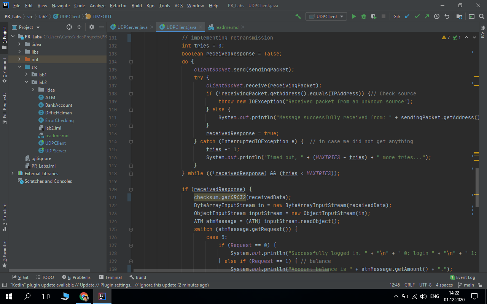
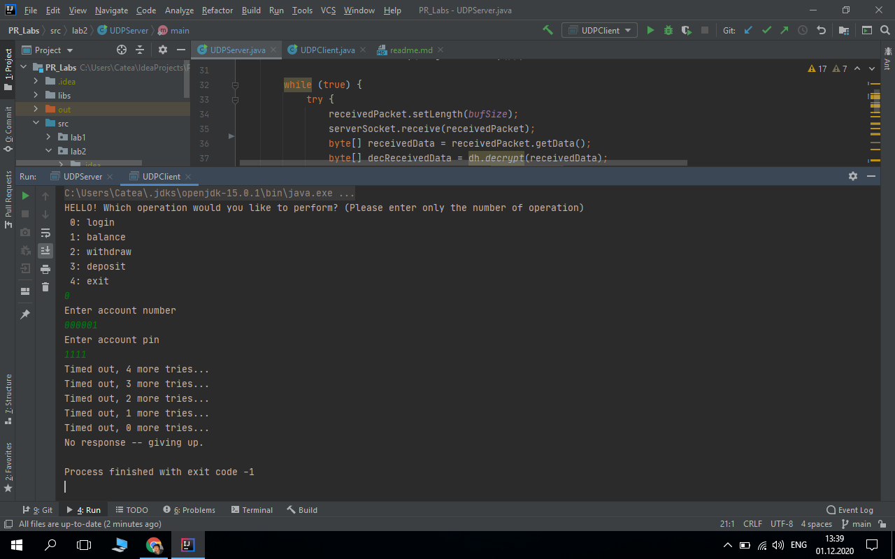
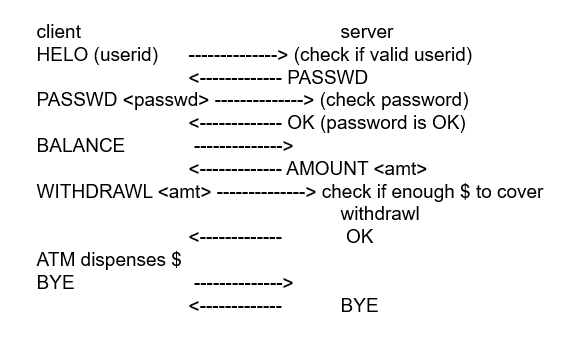
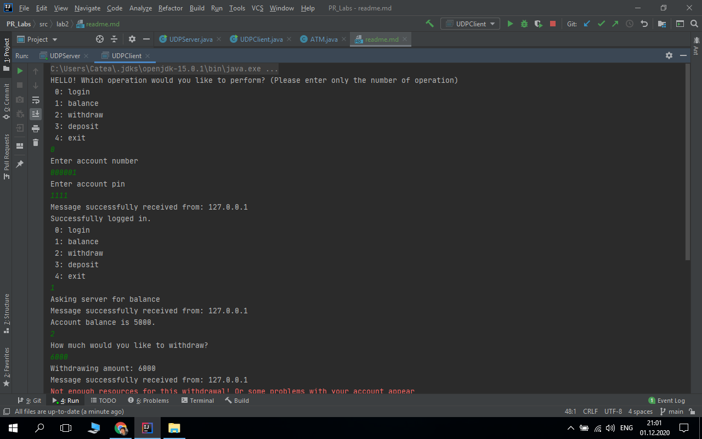
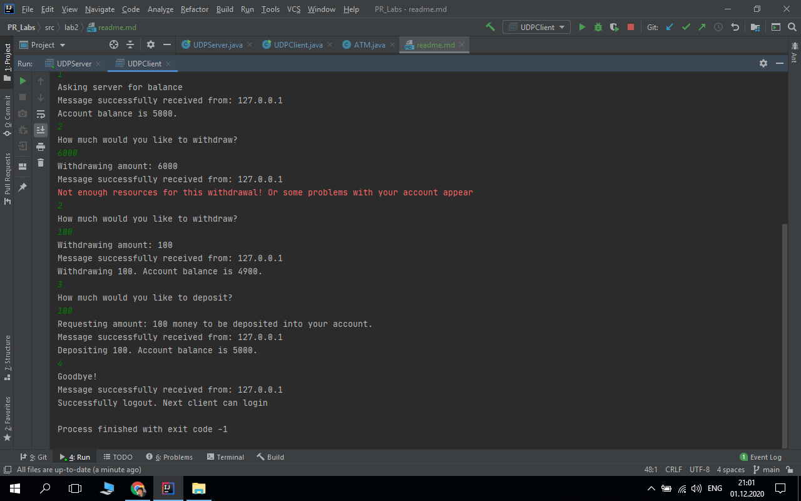

# Network Programming laboratory work nr. 2
Student: Gherbovei Ecaterina
## Task:
 * Implement a protocol atop UDP, with error checking and retransmissions. Limit the number of retries for retransmissions.
 * Make the connection secure, using either a CA to get the public key of the receiver and encrypt data with it, or using Diffie-Hellman to get a shared connection key between the client and server, ensure that the traffic is encrypted.
 * Regarding the application-level protocol, you have 3 options:
   - make an FTP-like protocol for data transfer, thus you will need to ensure data splitting and in-order delivery and reassembly at the destination. The protocol must support URIs, file creation and update (PUT), file fetching (GET) and metadata retrieval (OPTIONS)
   - make a protocol based on the workings (state machine) of an ATM
   - make a protocol based on the workings (state machine) of a stationary telephone
## Implementation:
 For this laboratory work I implemented a UDP protocol in Java using Datagram Sockets.
 For this purpose I created 2 classes, one for UDP Server ```UDPServer.java``` and another one for UDP Client ```UDPClient.java```.
 Both of these classes have the main method, also the port for the connection is mentioned and I used the port 5005. In both classes
 I instantiated a socket at that port. When the client want to send a message to the server, it create the DatagramPacket and use the ```send(DatagramPacket)``` method  
in my case:
```
DatagramPacket sendingPacket = new DatagramPacket(encSendingData, encSendingData.length, IPAddress, port);
clientSocket.send(sendingPacket);
```
As we know UDP doesn't support error checking and retransmission, but we have to implement this.
For error checking I created ```ErrorChecking.java``` class with the method: ```getCRC32()```
here I used cyclic redundancy check CRC32, that use polynomials of length 33 bits.
```Java
public class ErrorChecking {
    public static long getCRC32(byte[] bytes) {
        Checksum crc32 = new CRC32();
        crc32.update(bytes, 0, bytes.length);
        return crc32.getValue();
    }
}
```
Using this method we get the current checksum value of the byte array. So we apply this method to sending and receiving data buffer to get the checksum 
in both server and client. Once the class is instantiated, we use the update method to update the Checksum instance with the bytes from the input.
Simply put, the update method replaces the bytes held by the CRC32 Object – this helps with code re-use and negates the need to create new instances of Checksum.

Regarding the retransmission I implemented it in the ```UDPClient.java``` class when I send and receive messages.
I set up the number of retransmissions to 5 times using the MAXTRIES variable and the TIMEOUT variable with 3000 miliseconds.
The part of code where I implemented the retransmission is the following:

In this screenshot we can see tha we have the variable tries that is the nr of how many times we retransmited the message.
So, we send the message packet and receive the response from the server while the receivedResponse variable (it is the variable that indicate
if we received the response or not, initially it is false) is equal to false and tries variable is smaller than MAXTRIES.
In case we receive the message and receivedResponse variable become true, now we can read the received message.
But in case we didn't receive the message all the times we get the following output:


Now about secure connection I used Diffie Hellman algorithm for key exchange in this purpose I created a new class ```DiffieHelman.java```
using 2 method ```makeKeyExchangeParams()``` and ```setReceiverPublicKey()``` for generating key pair and shared secret. 
Also I have one method for encrypting message and another one for its decrypting.
I used Java Cipher class that represents an encryption/decryption algorithm.
In my example I uses the AES algorithm, and I return the result encoded into base 64 for encryption.
But for decryption I also use the Cipher java class to decrypt the message and then I decode it.

For the application level protocol I decided to make an protocol based on the workings of an ATM system.
For ATM prototype I used the following schema:

So, the same as in this schema I have clients that have an bank account, to create new account I have the class ```BankAccount```
with its help I can create new account with the specified account number, pin and balance. Every bank account has an owner described by ```ATM``` class
that is basically a client that make a request. This class was created especially to track client request and for the server to send a response to client.
In the UDPClient class I have a switch case statement that in dependence of client request create a new ATM object with the specified request
and sent it to the server to be processed. For example if the client select the balance option it will create a new ATM object with the nr. of the request that is 1
```
case 1: // 1: balance
       atm.setClientRequest("Balance");
       System.out.println("Asking server for balance");
       atm = new ATM(1, -1, -1, -1);
       break;
```
In this case the server will receive the message, will read this object and using the getRequest() method it will obtain 
the request nr. and will prepare and send the response using the sendRequestResponse() method.
```
case 1: //Balance
                        if (value != null) {
                            for (BankAccount bankAccount : atm.bankAccounts) {
                                if (bankAccount.getAccountNum() == value) {
                                    sendRequestResponse(5, bankAccount.getBalance(), receivedPacket.getAddress(), receivedPacket.getPort());
                                    break;
                                }
                            }

                        } else {
                            sendRequestResponse(6, -1, receivedPacket.getAddress(), receivedPacket.getPort());

                        }
                        break;
```
The sendRequestResponse() method will create a datagram socket to send the response. The response will be sent also using the ATM class
creating an ATM object that will contain the responseType and Amount. The responseType can be 5 or 6. In case it is 5 we will have the successful response displayed by the client,
but if the response is 6 it meaning an error.

When I get the result message from the server in the format of an ATM object, I also have here a switch case statement
that verify the response type if it is 5 or 6 and print the result in dependence of the client request
For example if the response type is 5 we have :
```
case 5:
                            if (Request == 0) {
                                System.out.println("Successfully logged in. " + "\n" + " 0: login " + "\n" + " 1: balance" + "\n" + " 2: withdraw" + "\n" + " 3: deposit" + "\n" + " 4: exit");
                            } else if (Request == 1) { // balance
                                System.out.println("Account balance is " + responseMessage.getAmount() + ".");
                                responseMessage.setBalance(responseMessage.getAmount());
                            } else if (Request == 2) { // withdraw
                                System.out.println("Withdrawing " + amount + ". Account balance is " + responseMessage.getAmount() + ".");
                                responseMessage.setBalance(responseMessage.getAmount());
                            } else if (Request == 3) { // deposit
                                System.out.println("Depositing " + amount + ". Account balance is " + responseMessage.getAmount() + ".");
                                responseMessage.setBalance(responseMessage.getAmount());
                            } else if (Request == 4) {
                                System.out.println("Successfully logout. Next client can login ");
                            }
                            break;
```

Finally we get the following output:

